# Waldur Federation User Guide

## Introduction

Waldur Federation is an **OpenID Federation 1.0 Trust Anchor** service that provides cryptographic trust chains, entity discovery, metadata policy enforcement, and trust mark management for coordinating multiple Waldur instances and other federation participants.

**OpenID Federation 1.0** is a standard that enables organizations to establish trust relationships without pre-configuring each pair of participants. Instead of bilateral agreements, entities form a hierarchical trust chain anchored by a Trust Anchor — a root authority whose public key is known to all participants. Each level in the chain issues signed statements (JWTs) about its subordinates, creating a verifiable path from any entity back to the anchor.

### Who this guide is for

This guide is written for **federation administrators** — the people responsible for:

- Registering and managing entities (OpenID Providers, Relying Parties, intermediaries)
- Defining and enforcing metadata policies across the federation
- Issuing and revoking trust marks
- Monitoring statement health and key rotation
- Visualizing and troubleshooting the trust chain hierarchy

### Prerequisites

- Access to the Waldur Federation web interface (typically at your organization's deployment URL)
- Basic understanding of OpenID Connect concepts (providers, relying parties, tokens)
- Administrative credentials for your federation instance

---

## Navigation

The application has a persistent sidebar on the left organized into four groups:

| Group | Section | Description |
|-------|---------|-------------|
| — | **Dashboard** | Overview of federation statistics, expiring items, and recent activity |
| **Federation** | **Topology** | Waldur instance registration, connectivity graph, and push notifications |
| | **Entities** | Browse, register, and manage federation participants |
| | **Trust Chain** | Interactive graph visualization of the trust hierarchy |
| **Governance** | **Policies** | Define metadata constraints and check compliance |
| | **Trust Marks** | Create trust mark definitions and issue marks to entities |
| **Operations** | **Keys** | View and rotate entity signing keys |
| **Debug** | **Scenarios** | Run predefined test scenarios for federation and security workflows |

Each page includes **Help** buttons (marked with "?") that provide contextual tooltips explaining federation concepts.

---

## Dashboard

The Dashboard is the landing page and provides a focused overview of your federation's current state.

### Stat Cards

The top of the dashboard displays four **stat cards**:

| Card | What it shows |
|------|--------------|
| **Entities** | Total registered entities and how many are active |
| **Statements** | Total subordinate statements and how many are expiring soon |
| **Trust Marks** | Total issued trust marks and number of definitions |
| **Active Keys** | Total active signing keys across all entities |

### Federation Instances

A summary banner showing how many registered Waldur instances are connected, the number of federations, and total users. Click "View Federation →" to go to the Topology page.

### Expiring Items

A warning banner listing statements and trust marks that will expire within 7 days, with their exact expiry dates. This is your primary indicator for items needing immediate attention.

### Recent Activity

A chronological feed of recent federation events (statement issuance, entity registrations, trust mark issuance/revocation) with relative timestamps.

### Quick Actions

Shortcut links to common tasks:
- Register Entity
- View Trust Chain
- Manage Policies

---

## Entities

Entities are the participants in your federation — OpenID Providers, Relying Parties, federation operators, and other roles defined by the OpenID Federation specification.

### Browsing and Filtering

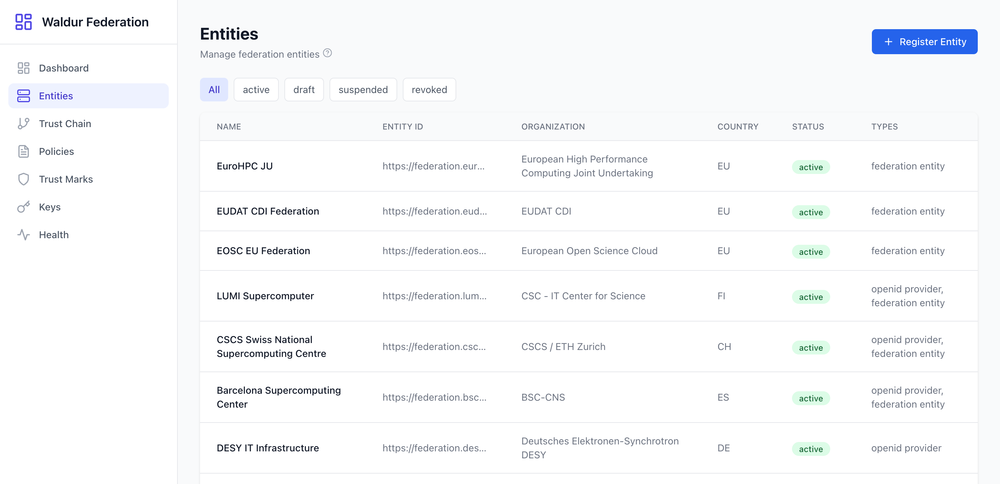

The Entities page displays a sortable table with columns:

| Column | Description |
|--------|-------------|
| **Name** | Human-readable entity name |
| **Entity ID** | The canonical URL identifier (e.g., `https://federation.lumi.csc.fi`) |
| **Organization** | The organization operating this entity |
| **Country** | ISO alpha-2 country code |
| **Status** | Current lifecycle status |
| **Types** | Entity types (openid provider, federation entity, etc.) |

#### Status Filters


Use the filter buttons at the top to narrow the list by status:

- **All** — Show all entities regardless of status
- **active** — Only entities currently participating in the federation
- **draft** — Entities registered but not yet activated
- **suspended** — Entities temporarily removed from the trust chain
- **revoked** — Entities permanently removed

### Entity Detail

Clicking on an entity row opens the detail page with four tabs.

#### Overview Tab

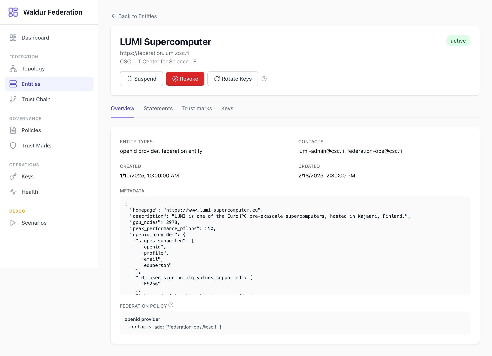

The overview shows:

- **Entity header** — Name, Entity ID URL, organization, country, and status badge
- **Action buttons** — Suspend, Revoke, and Rotate Keys (available for active entities)
- **Entity Types** — The roles this entity plays in the federation
- **Contacts** — Administrative email addresses
- **Created / Updated** — Timestamps for tracking registration and changes
- **Metadata** — Full JSON metadata including OpenID Provider configuration (scopes, signing algorithms, auth methods) and federation entity details
- **Federation Policy** — If the entity has a current subordinate statement with a metadata policy, a summary is shown here. Displays the policy operators (e.g., `essential`, `one_of`, `add`) applied to each attribute, grouped by entity type. Click the help icon for an explanation of what metadata policies enforce.

#### Statements Tab

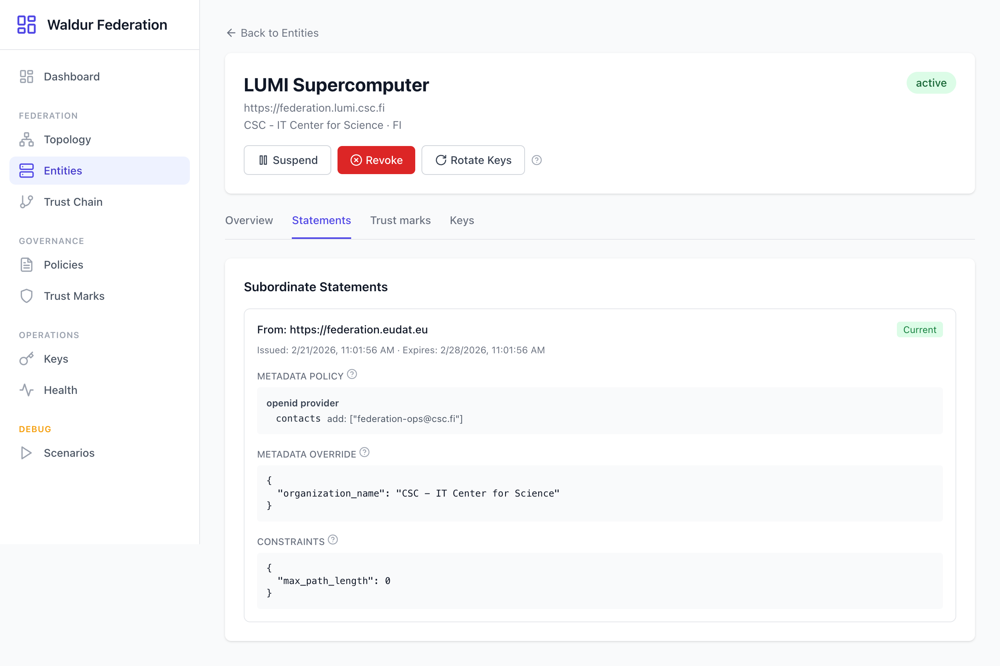

Lists all subordinate statements where this entity is either the issuer or subject:

- **From** — The issuing authority's entity ID
- **Status** — Whether the statement is current or historical
- **Issued / Expires** — Timestamp range for the statement's validity
- **Metadata Policy** — If present, shows the policy operators applied to each attribute, grouped by entity type (e.g., `contacts add: ["federation-ops@csc.fi"]`). These are the rules the Trust Anchor enforces on this entity's metadata.
- **Metadata Override** — If present, shows the JSON values that the Trust Anchor sets on behalf of this entity (e.g., overriding `organization_name`).
- **Constraints** — If present, shows constraints like `max_path_length` that limit the entity's role in the trust chain (0 = leaf entity, higher values allow further delegation).

Each section includes a help tooltip explaining the concept.

#### Trust Marks Tab

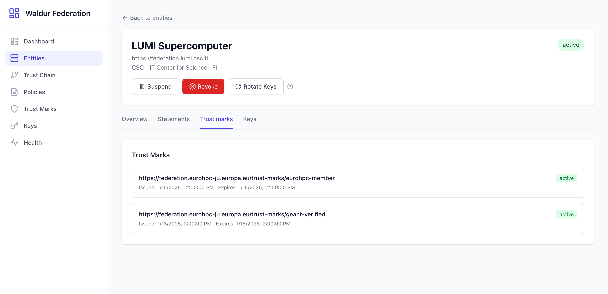

Shows trust marks assigned to this entity:

- **Trust Mark ID** — The URI identifying the trust mark definition
- **Status** — Active or revoked
- **Issued / Expires** — Validity period of the signed trust mark JWT

#### Keys Tab

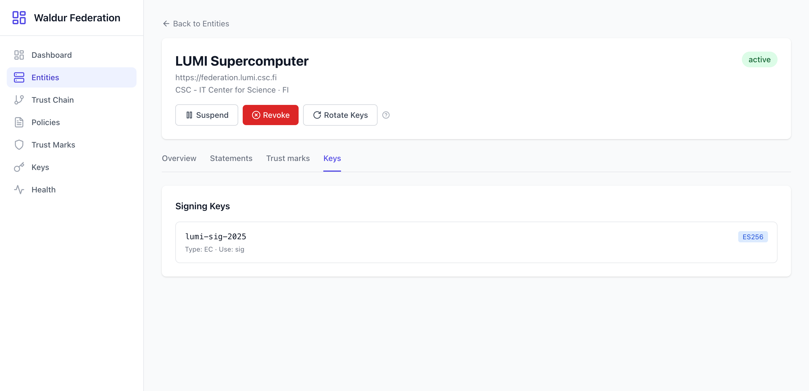

Displays the entity's signing keys:

- **Key ID (kid)** — The identifier used in JWT headers
- **Algorithm** — The signing algorithm (e.g., ES256)
- **Key Type** — The cryptographic key type (e.g., EC for Elliptic Curve)
- **Use** — Key usage (sig = signing)

### Registering a New Entity

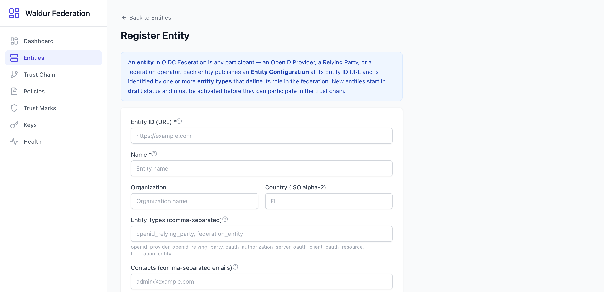

Click "Register Entity" from the entities list to open the registration form.

**Required fields:**

| Field | Description | Example |
|-------|-------------|---------|
| **Entity ID (URL)** | The canonical HTTPS URL that uniquely identifies this entity. Must be the URL where the entity will publish its Entity Configuration. | `https://federation.example.org` |
| **Name** | A human-readable name for the entity | `Example University IdP` |

**Optional fields:**

| Field | Description | Example |
|-------|-------------|---------|
| **Organization** | The organization operating this entity | `Example University` |
| **Country** | ISO alpha-2 country code | `FI` |
| **Entity Types** | Comma-separated list of entity roles | `openid_provider, federation_entity` |
| **Contacts** | Comma-separated administrative email addresses | `admin@example.org` |

Valid entity types: `openid_provider`, `openid_relying_party`, `oauth_authorization_server`, `oauth_client`, `oauth_resource`, `federation_entity`.

#### Entity Lifecycle

New entities start in **draft** status and follow this lifecycle:

```
draft  ──>  active  ──>  suspended  ──>  active   (can be reactivated)
                    ──>  revoked                   (permanent, cannot undo)
```

- **draft**: Registered but not yet participating. Activation requires signing keys to be assigned.
- **active**: Fully participating in the federation. Subordinate statements can be issued.
- **suspended**: Temporarily removed. Can be reactivated. Existing statements remain but are not renewed.
- **revoked**: Permanently removed. All statements are invalidated.

---

## Trust Chain Explorer

The Trust Chain Explorer provides an interactive graph visualization of your federation's trust hierarchy using a directed acyclic graph (DAG) layout.

### Graph Visualization

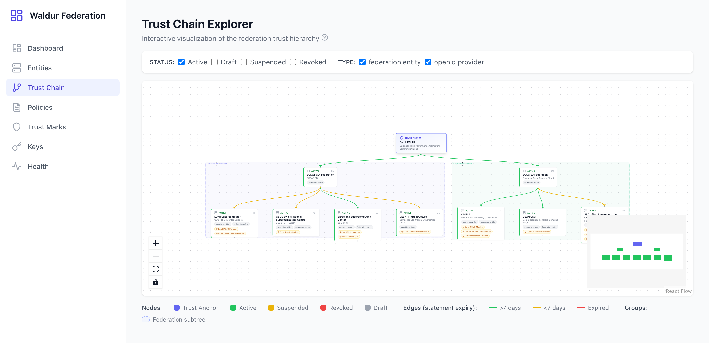

The graph displays:

- **Nodes** — Each entity is represented as a card showing its name, organization, country, entity types, and any trust marks it holds.
- **Edges** — Directed lines representing subordinate statements from an issuer (parent) to a subject (child).
- **Groups** — Dashed boundaries around federation subtrees showing which entities are managed by which intermediary.

#### Node Colors

| Color | Meaning |
|-------|---------|
| Purple/dark | Trust Anchor (root of trust) |
| Green | Active entity |
| Yellow | Suspended entity |
| Red | Revoked entity |
| Gray | Draft entity |

#### Edge Colors (Statement Expiry)

| Color | Meaning |
|-------|---------|
| Green | More than 7 days until expiry |
| Yellow/orange | Less than 7 days until expiry |
| Red | Expired statement |

#### Controls

- **Status filters** — Toggle visibility of entities by status (Active, Draft, Suspended, Revoked)
- **Type filters** — Toggle visibility by entity type (federation entity, openid provider)
- **Zoom In / Out** — Adjust the view scale
- **Fit View** — Auto-zoom to show all nodes
- **Toggle Interactivity** — Lock/unlock node dragging
- **Mini Map** — Bottom-right overview for navigation in large graphs

### Inspecting Nodes

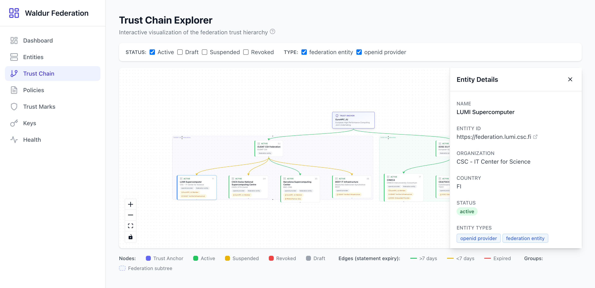

Click any node to open the **Entity Details** panel on the right side. The panel displays:

- Name and Entity ID (with link to the actual federation endpoint)
- Organization and country
- Current status
- Entity types
- Contact emails
- Signing key summary (algorithm and key ID)
- Trust marks held by this entity

### Inspecting Edges

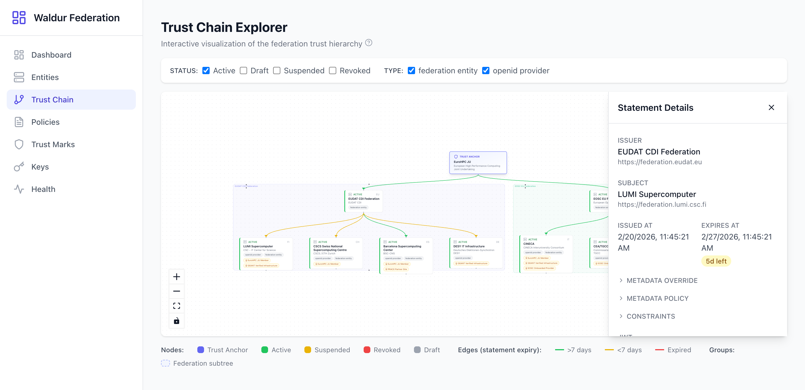

Click any edge (connecting line) to open the **Statement Details** panel showing:

- **Issuer** — The authority that signed this statement
- **Subject** — The entity the statement is about
- **Issued At / Expires At** — Validity window with a countdown (e.g., "5d left")
- **Metadata Override** — Any metadata the issuer sets on behalf of the subject
- **Metadata Policy** — Policy constraints applied through this statement
- **Constraints** — Additional restrictions (e.g., allowed entity types)
- **JWT** — The raw signed JWT with a "Copy full JWT" button for debugging

---

## Metadata Policies

Metadata policies let a federation operator constrain or normalize the metadata that subordinate entities can publish. When a trust chain is resolved, policies are applied top-down — each authority in the chain can tighten (but not relax) the constraints set by its parent.

### Browsing Policies

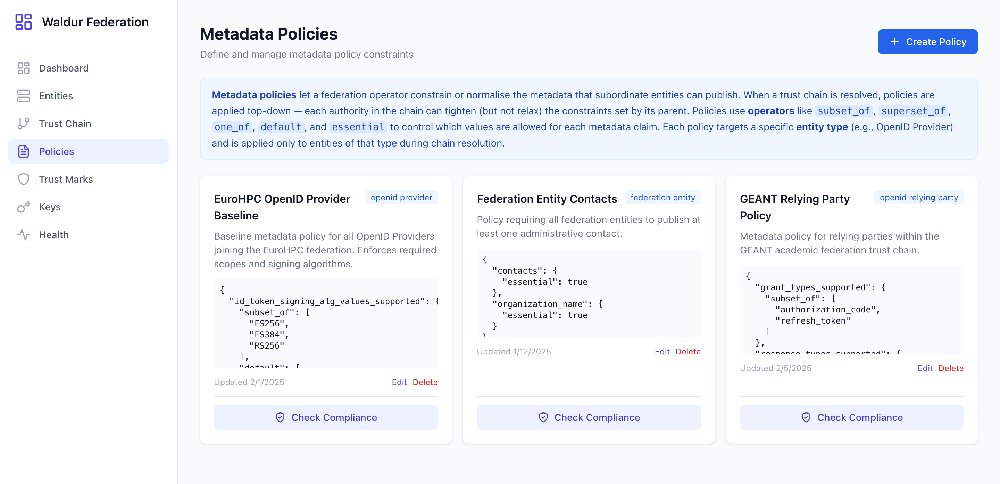

The Policies page lists all defined policies. Each policy card shows:

- **Name** — Human-readable policy name
- **Entity Type** — Which entity type this policy applies to (e.g., "openid provider")
- **Description** — What the policy enforces
- **Policy JSON** — The full policy definition showing claims and their operators
- **Last Updated** — When the policy was last modified
- **Actions** — Edit, Delete, and Check Compliance buttons

### Compliance Checks

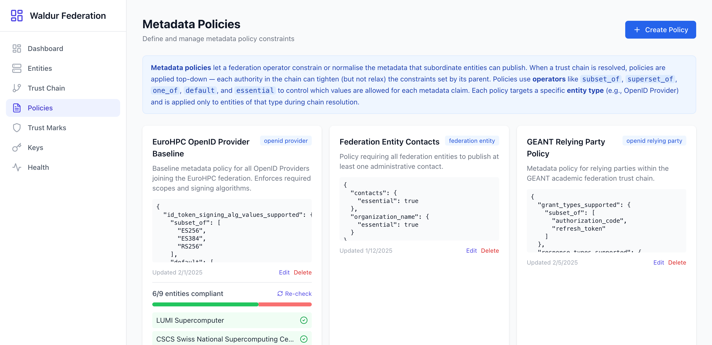

Click "Check Compliance" on any policy to evaluate all matching entities:

- The result shows a ratio (e.g., "6/9 entities compliant")
- Compliant entities are listed with a green indicator
- Non-compliant entities show a red indicator with an expand button to see violation details
- Click "Re-check" to run the evaluation again after making changes

### Policy Editor

The policy editor supports two modes for creating and editing policies.

#### Visual Mode

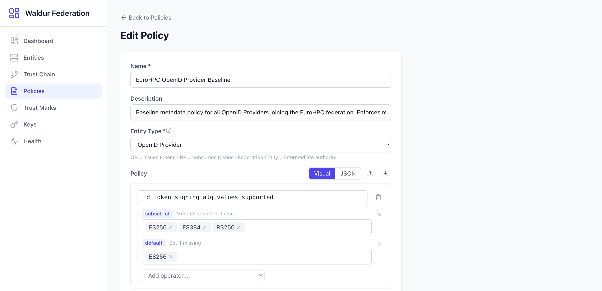

Visual mode provides a structured form:

- **Name** and **Description** fields at the top
- **Entity Type** dropdown to select which entity type the policy targets
- **Claims** — Each claim (e.g., `id_token_signing_alg_values_supported`) has:
  - A text input for the claim name
  - One or more **operators** with their values displayed as removable tags
  - An "Add operator" dropdown to add more constraints
  - A "Remove claim" button
- **Add claim** button at the bottom to define new claim constraints

#### JSON Mode

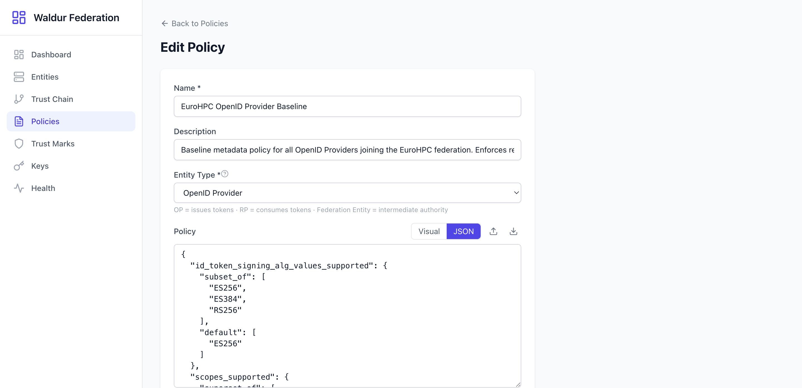

Click the "JSON" toggle to switch to a raw JSON editor. This is useful for:

- Copying policies from documentation or other systems
- Bulk editing complex policies
- Importing/exporting via the "Import JSON" and "Export JSON" buttons

### Policy Operators

Operators are the building blocks of metadata policies, as defined in the OIDC Federation 1.0 specification:

| Operator | Effect | Example |
|----------|--------|---------|
| **value** | Replace the claim value unconditionally | Force a specific signing algorithm |
| **add** | Append values to an existing list | Add required scopes |
| **default** | Set the value only if the claim is missing | Provide a fallback signing algorithm |
| **one_of** | The claim value must be one of the listed options | Restrict auth methods to approved ones |
| **subset_of** | The claim values must be a subset of the listed options | Limit allowed algorithms |
| **superset_of** | The claim values must include all listed options | Require minimum scopes |
| **essential** | The claim must be present (boolean) | Require contacts to be published |

---

## Trust Marks

Trust marks are signed credentials (JWTs) that assert an entity meets certain criteria — like a digital badge. Unlike subordinate statements which form the structural trust chain, trust marks are orthogonal quality signals that relying parties can optionally require.

### Definitions

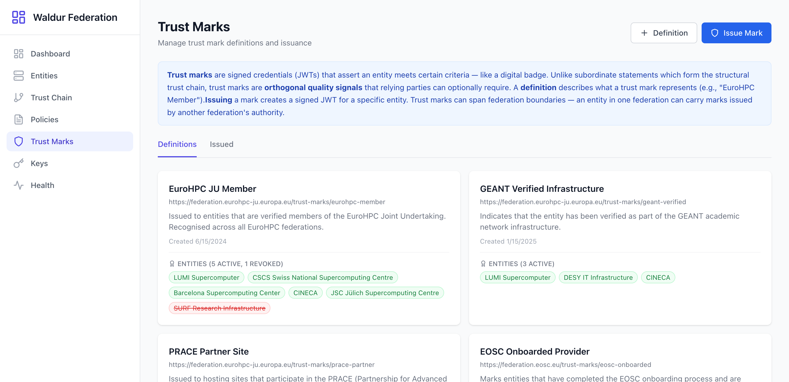

The Definitions tab lists all trust mark types. Each definition shows:

- **Name** — Human-readable name (e.g., "EuroHPC JU Member")
- **Trust Mark ID** — The canonical URI for this trust mark type
- **Description** — What the trust mark certifies
- **Created** — When the definition was created
- **Entities** — Count and list of entities holding this mark, broken down by active and revoked status

To create a new definition, click the "Definition" button at the top.

### Issued Marks

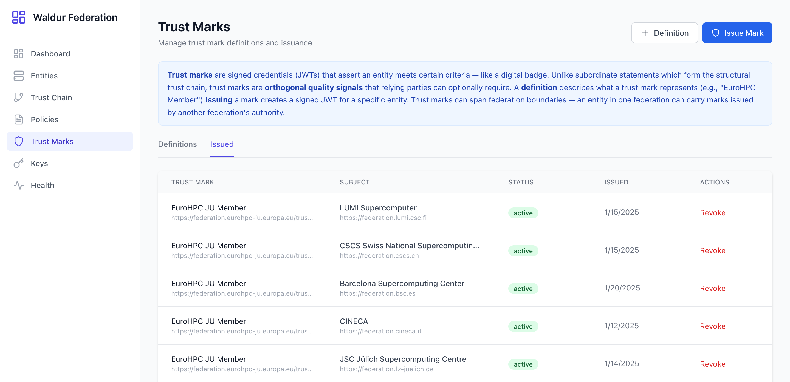

The Issued tab shows a table of every trust mark instance:

| Column | Description |
|--------|-------------|
| **Trust Mark** | The definition name and ID |
| **Subject** | The entity name and Entity ID that holds this mark |
| **Status** | Active or revoked |
| **Issued** | Date the mark was issued |
| **Actions** | Revoke button (for active marks) |

To issue a new trust mark, click "Issue Mark" and select a definition and target entity.

#### Revoking a Trust Mark

Click the "Revoke" button on any active trust mark. Revocation is immediate — the trust mark JWT becomes invalid and the entity will no longer present this credential during trust chain resolution.

---

## Signing Keys

Each entity has a JSON Web Key Set (JWKS) containing the cryptographic keys used to sign its Entity Configuration, subordinate statements, and trust marks.

### Key Management

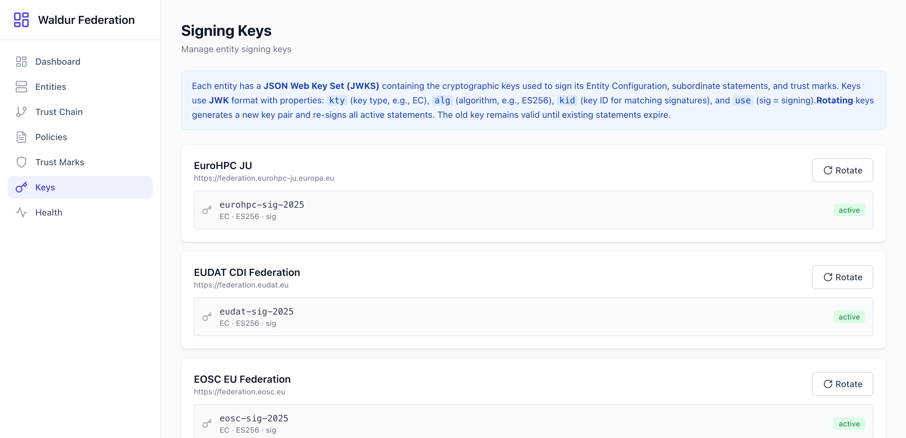

The Keys page lists all entities and their signing keys. Each entry shows:

- **Entity name** and Entity ID
- **Rotate** button to trigger key rotation
- **Key details**:
  - **Key ID (kid)** — The identifier referenced in JWT headers (e.g., `eurohpc-sig-2025`)
  - **Key Type (kty)** — The cryptographic algorithm family (e.g., EC for Elliptic Curve)
  - **Algorithm (alg)** — The specific signing algorithm (e.g., ES256)
  - **Use** — Key purpose (sig = signing)
  - **Status** — Active or rotated

### Key Rotation

Key rotation is an important security practice. When you rotate keys:

1. A new key pair is generated with the configured algorithm
2. The new key becomes the active signing key
3. All active subordinate statements are re-signed with the new key
4. The old key is marked as "rotated" and remains in the historical JWKS
5. Existing statements signed with the old key remain valid until they expire

To rotate a key, click the **Rotate** button next to the entity. The old key is published at the `/.well-known/openid-federation` historical keys endpoint so that verifiers can still validate previously-issued JWTs.

### JWK Properties

| Property | Description |
|----------|-------------|
| `kty` | Key type — EC (Elliptic Curve) or RSA |
| `alg` | Algorithm — ES256 (ECDSA P-256) or RS256 (RSASSA-PKCS1-v1_5) |
| `kid` | Key ID — a unique identifier (typically based on JWK Thumbprint, RFC 7638) |
| `use` | Usage — `sig` for signing |
| `crv` | Curve — P-256 for ES256 keys |

---

## Federation Topology

The Topology page shows the registered Waldur instances that participate in the federation and their relationships to Trust Anchors.

### Overview

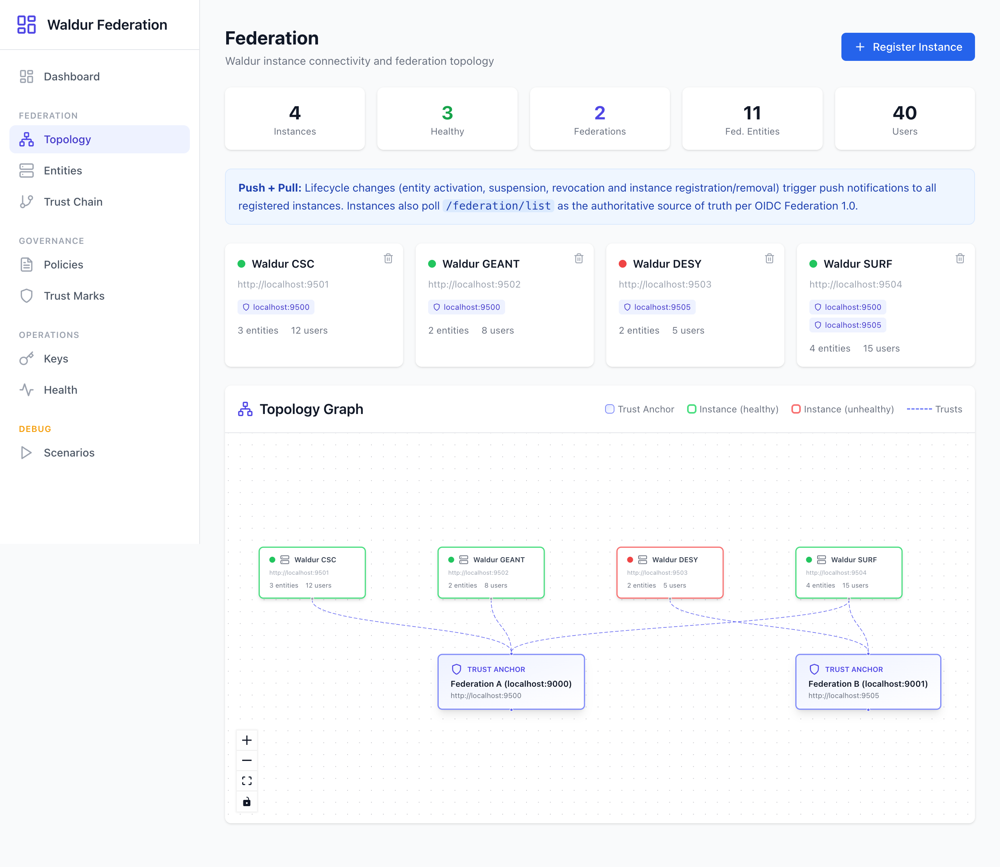

The page is organized into:

#### Summary Bar

Five counters at the top:

| Counter | Description |
|---------|-------------|
| **Instances** | Total registered Waldur instances |
| **Healthy** | Instances that are reachable and responding |
| **Federations** | Number of distinct Trust Anchors in use |
| **Fed. Entities** | Total federation entities across all instances |
| **Users** | Total users across all instances |

#### Push + Pull Banner

An info banner explaining that lifecycle changes (entity activation, suspension, revocation, and instance registration/removal) trigger push notifications to all registered instances. Instances also poll `/federation/list` as the authoritative source of truth per OIDC Federation 1.0.

#### Instance Health Cards

Each registered Waldur instance is shown as a card displaying:

- **Status indicator** — Green dot for healthy, red for unhealthy, gray for unknown
- **Name and Base URL** — The instance identifier and endpoint
- **Trust Anchors** — Badges showing which federation Trust Anchors this instance trusts
- **Entity and user counts** — How many entities and users the instance has
- **Remove button** — Delete the instance from the federation (with confirmation dialog)

#### Topology Graph

An interactive graph visualization (powered by @xyflow and Dagre layout) showing:

- **Trust Anchor nodes** — Purple/indigo gradient cards at the bottom representing federation roots
- **Instance nodes** — Cards at the top with status-colored borders (green = healthy, red = unhealthy)
- **Trust edges** — Dashed animated lines connecting instances to the Trust Anchors they trust

The legend in the top-right explains the node and edge types. Click any node to open a detail panel showing connected instances or federation entities.

### Registering an Instance

Click "Register Instance" to add a new Waldur deployment. Provide:

- **Name** — Human-readable instance name (e.g., "Waldur CSC")
- **Base URL** — The instance's API endpoint (e.g., `http://localhost:9501`)

### Removing an Instance

Click the trash icon on any instance card. A confirmation dialog shows the impact: how many entities, users, and trust anchors are affected. All registered instances receive a push notification about the removal.

---

## Scenarios

The Scenarios page provides a debug-only test runner for verifying federation workflows and security boundaries. It is only visible when the backend runs in debug mode (`DEBUG=true`).

### Running Scenarios

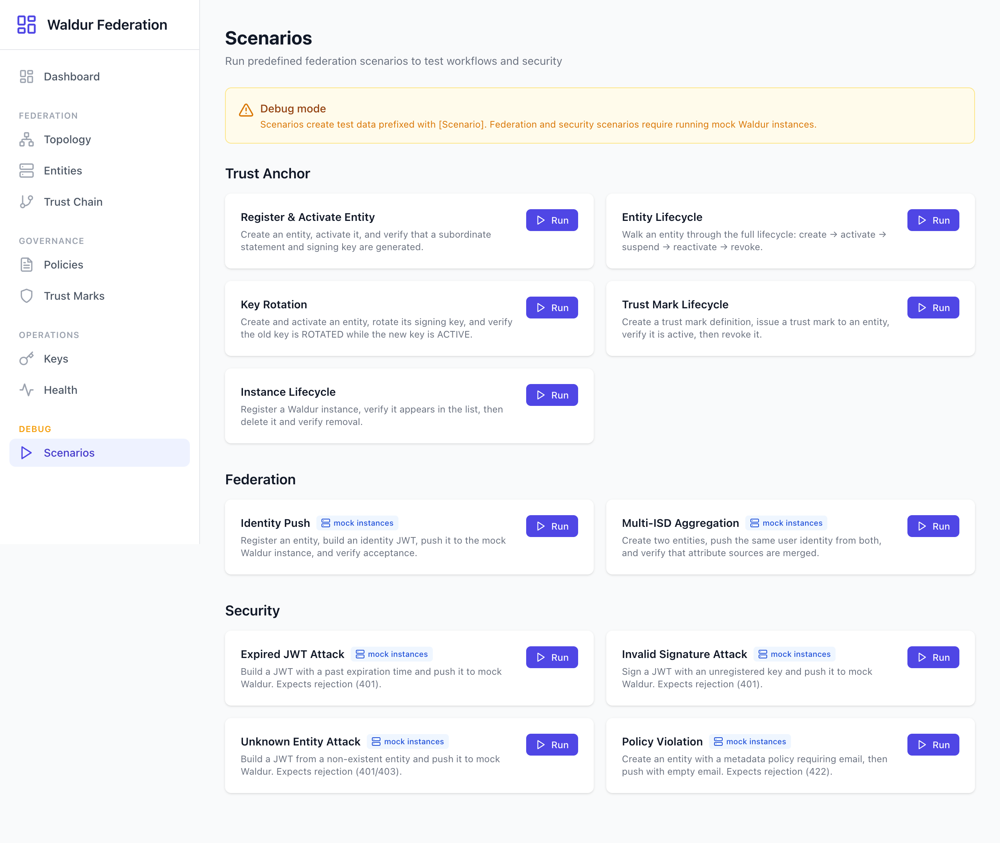

Scenarios are organized into three categories:

#### Trust Anchor

Database-only scenarios that always work without external dependencies:

| Scenario | Description |
|----------|-------------|
| **Register & Activate Entity** | Create an entity, activate it, and verify a subordinate statement and signing key are generated |
| **Entity Lifecycle** | Walk an entity through the full lifecycle: create → activate → suspend → reactivate → revoke |
| **Key Rotation** | Create and activate an entity, rotate its signing key, and verify the old key is ROTATED while the new key is ACTIVE |
| **Trust Mark Lifecycle** | Create a trust mark definition, issue a trust mark to an entity, verify it is active, then revoke it |
| **Instance Lifecycle** | Register a Waldur instance, verify it appears in the list, delete it, and verify removal |

#### Federation

Scenarios that require running mock Waldur instances (marked with a "mock instances" badge):

| Scenario | Description |
|----------|-------------|
| **Identity Push** | Register an entity, build an identity JWT, push it to a mock Waldur instance, and verify acceptance |
| **Multi-ISD Aggregation** | Create two entities, push the same user identity from both, and verify that attribute sources are merged |

#### Security

Attack vector tests that verify the federation rejects invalid or malicious requests (marked with "mock instances"):

| Scenario | Description |
|----------|-------------|
| **Expired JWT Attack** | Build a JWT with a past expiration time and push it — expects rejection (401) |
| **Invalid Signature Attack** | Sign a JWT with an unregistered key and push it — expects rejection (401) |
| **Unknown Entity Attack** | Build a JWT from a non-existent entity and push it — expects rejection (401/403) |
| **Policy Violation** | Create an entity with a metadata policy requiring email, then push with empty email — expects rejection (422) |

### Scenario Results

Click "Run" on any scenario to execute it. Each scenario displays step-by-step results with:

- **Step name** — What was tested
- **Status** — Passed (green), failed (red), or skipped (gray)
- **Detail** — Description of the outcome
- **Duration** — How long the step took

The overall scenario result is shown as passed, failed, or partial.

---

## Glossary

| Term | Definition |
|------|------------|
| **Trust Anchor** | The root authority in a federation. Its public key is the ultimate trust root — all trust chains terminate at a Trust Anchor. In this application, the Waldur Federation instance acts as the Trust Anchor. |
| **Intermediate Authority** | An entity that sits between the Trust Anchor and leaf entities. It receives a subordinate statement from a parent and issues subordinate statements to its own children. Used to delegate management of subsets of the federation. |
| **Leaf Entity** | An entity at the bottom of the trust chain (e.g., an OpenID Provider or Relying Party). It does not issue subordinate statements to others. |
| **Entity Configuration** | A signed JWT that an entity publishes at `/.well-known/openid-federation` on its Entity ID URL. Contains the entity's metadata, public keys, authority hints, and trust marks. |
| **Subordinate Statement** | A signed JWT issued by a superior authority (Trust Anchor or Intermediate) about a subordinate entity. Contains metadata overrides, metadata policies, and constraints. Forms the links in a trust chain. |
| **Trust Chain** | An ordered sequence of signed JWTs from a leaf entity's Entity Configuration up through subordinate statements to the Trust Anchor. Verifiers resolve this chain to establish trust. |
| **Trust Mark** | A signed JWT asserting that an entity meets specific criteria. Acts as a verifiable credential or badge. Unlike subordinate statements, trust marks are optional quality signals. |
| **Metadata Policy** | A set of rules (operators) that constrain which metadata values subordinate entities can publish. Applied during trust chain resolution. |
| **JWK / JWKS** | JSON Web Key / JSON Web Key Set. The standard format for representing cryptographic keys. Each entity's public keys are published in a JWKS within their Entity Configuration. |
| **Entity ID** | A URL that uniquely identifies a federation participant. The entity publishes its Entity Configuration at this URL. |
| **kid (Key ID)** | A unique identifier for a specific key within a JWKS. Used in JWT headers to indicate which key was used for signing. |
| **ES256** | ECDSA using the P-256 curve and SHA-256 hash. The recommended signing algorithm for OpenID Federation. |
| **RS256** | RSASSA-PKCS1-v1_5 using SHA-256. An alternative signing algorithm supported for backwards compatibility. |
